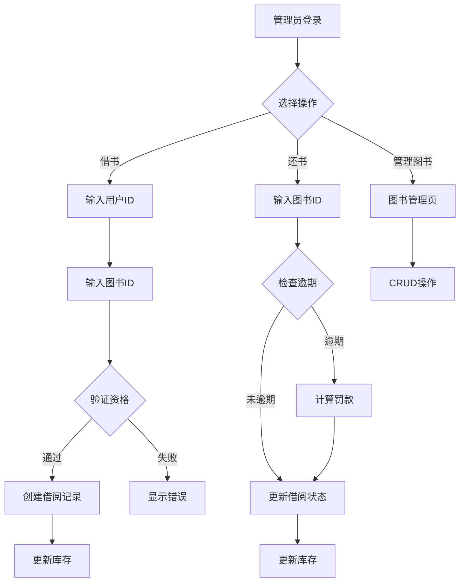

# 图书馆管理系统 - 产品需求文档 (PRD)

## 1. 产品概述
图书馆管理系统是一个用于管理图书借阅、归还和用户信息的Web应用，旨在提高图书馆运营效率，简化日常管理流程。
- 解决图书管理繁琐、借阅流程复杂的问题
- 适用于中小型图书馆、学校图书馆或社区图书室

## 2. 核心功能

### 2.1 用户角色
| 角色 | 注册方式 | 核心权限 |
|------|----------|----------|
| 管理员 | 系统预设 | 图书管理、用户管理、借阅管理、分类管理、统计分析、借还书操作 |
| 普通用户 | 管理员添加 | 查询图书、自助借书、查看借阅记录、自助还书 |

### 2.2 功能模块
1. **登录页**: 用户认证、权限验证
2. **管理后台首页**: 数据概览、快捷操作入口
3. **图书管理**: 图书列表、增删改查、分类筛选、库存管理
4. **借阅管理**: 借书、还书、借阅记录查询、逾期管理
5. **用户管理**: 用户列表、添加用户、编辑用户信息、权限管理
6. **图书分类管理**: 分类增删改查、分类树展示

### 2.3 页面详情
| 页面名称 | 模块名称 | 功能描述 | 访问权限 |
|----------|----------|----------|----------|
| 登录页 | 登录表单 | 用户名密码登录、记住密码、错误提示 | 所有用户 |
| 首页 | 数据看板 | 今日借阅数、在借图书、逾期提醒、最近操作 | 管理员 |
| 首页 | 快捷操作 | 快速借书、快速还书、添加图书 | 管理员 |
| 图书管理 | 图书列表 | 分页展示、搜索筛选、状态显示 | 管理员 |
| 图书管理 | 图书表单 | 新增/编辑图书信息（书名、作者、ISBN、分类、库存、封面图片） | 管理员 |
| 图书查询 | 图书列表 | 搜索筛选、查看图书详情、自助借书 | 所有用户 |
| 借阅管理 | 借还书 | 扫描/输入用户ID和图书ID进行借还操作 | 管理员 |
| 借阅管理 | 借阅记录 | 按时间、用户、图书筛选，显示借阅状态、自助还书 | 所有用户 |
| 用户管理 | 用户列表 | 分页展示、搜索、状态管理 | 管理员 |
| 用户管理 | 用户表单 | 新增/编辑用户（姓名、联系方式、角色） | 管理员 |
| 分类管理 | 分类列表 | 树形展示分类层级、增删改操作 | 管理员 |

## 3. 核心流程

### 3.1 管理员借书流程
管理员登录 → 选择借书功能 → 输入/扫描用户ID → 输入/扫描图书ID → 验证借阅资格（是否超期、是否达上限）→ 确认借阅 → 更新库存和记录

### 3.2 普通用户自助借书流程
普通用户登录 → 进入图书查询页面 → 搜索/浏览图书 → 选择图书并点击"借书" → 系统自动校验借阅资格 → 确认借阅 → 更新库存和记录

### 3.3 管理员还书流程
管理员登录 → 选择还书功能 → 输入/扫描图书ID → 检查是否逾期 → 计算罚款（如有）→ 确认还书 → 更新库存和记录

### 3.4 普通用户自助还书流程
普通用户登录 → 进入借阅记录页面 → 选择借阅中的记录 → 点击"还书" → 系统检查是否逾期 → 计算罚款（如有）→ 确认还书 → 更新库存和记录



## 4. 用户界面设计

### 4.1 设计风格
- **主色调**: 深蓝色(#1a365d) + 暖金色(#d4a574) - 营造专业、学术氛围
- **辅助色**: 浅灰背景(#f7f5f2)、白色卡片、成功绿、警告橙、错误红
- **按钮风格**: 圆角(8px)、渐变背景、悬停动画效果
- **字体**: 中文使用系统字体栈，英文使用 Merriway(标题) + Source Sans Pro(正文)
- **布局**: 左侧导航 + 右侧内容区，卡片式设计
- **图标**: 简洁线性图标风格

### 4.2 页面设计概览
| 页面名称 | 模块名称 | UI元素 |
|----------|----------|--------|
| 登录页 | 登录卡片 | 居中卡片、圆角阴影、输入框带图标、登录按钮渐变动画 |
| 首页 | 数据看板 | 4个统计卡片、图表展示趋势、快捷操作按钮 |
| 图书管理 | 列表页 | 顶部搜索栏、筛选下拉、表格展示、分页器、操作按钮 |
| 借阅管理 | 操作页 | 左右分栏（用户信息+图书信息）、确认按钮、历史记录 |
| 用户管理 | 列表页 | 搜索、筛选、表格、状态标签、操作列 |

### 4.3 响应式设计
- 桌面优先设计，支持最小1024px宽度
- 平板和移动端自适应布局，侧边栏可折叠
- 触摸优化：按钮最小44px触控区域

## 5. 数据字典

### 5.1 用户表 (users)
| 字段 | 类型 | 约束 | 说明 |
|------|------|------|------|
| id | INTEGER | PK, AUTOINCREMENT | 用户ID |
| username | VARCHAR(50) | UNIQUE, NOT NULL | 用户名 |
| password_hash | VARCHAR(255) | NOT NULL | 密码哈希 |
| name | VARCHAR(100) | NOT NULL | 姓名 |
| phone | VARCHAR(20) | - | 手机号 |
| email | VARCHAR(100) | - | 邮箱 |
| role | VARCHAR(20) | DEFAULT 'user' | 角色：admin/user |
| status | VARCHAR(20) | DEFAULT 'active' | 状态：active/inactive |
| created_at | DATETIME | DEFAULT CURRENT_TIMESTAMP | 创建时间 |

### 5.2 图书表 (books)
| 字段 | 类型 | 约束 | 说明 |
|------|------|------|------|
| id | INTEGER | PK, AUTOINCREMENT | 图书ID |
| title | VARCHAR(200) | NOT NULL | 书名 |
| author | VARCHAR(100) | NOT NULL | 作者 |
| isbn | VARCHAR(20) | UNIQUE, NOT NULL | ISBN |
| category_id | INTEGER | FK → categories.id | 分类ID |
| publisher | VARCHAR(100) | - | 出版社 |
| publish_date | DATE | - | 出版日期 |
| total_copies | INTEGER | DEFAULT 1 | 总库存 |
| available_copies | INTEGER | DEFAULT 1 | 可借库存 |
| image_base64 | TEXT | - | 封面图片Base64编码，默认为空 |
| created_at | DATETIME | DEFAULT CURRENT_TIMESTAMP | 创建时间 |

### 5.3 分类表 (categories)
| 字段 | 类型 | 约束 | 说明 |
|------|------|------|------|
| id | INTEGER | PK, AUTOINCREMENT | 分类ID |
| name | VARCHAR(100) | NOT NULL | 分类名称 |
| parent_id | INTEGER | FK → categories.id | 父分类ID |

### 5.4 借阅记录表 (borrow_records)
| 字段 | 类型 | 约束 | 说明 |
|------|------|------|------|
| id | INTEGER | PK, AUTOINCREMENT | 记录ID |
| user_id | INTEGER | FK → users.id, NOT NULL | 用户ID |
| book_id | INTEGER | FK → books.id, NOT NULL | 图书ID |
| borrow_date | DATETIME | DEFAULT CURRENT_TIMESTAMP | 借阅时间 |
| return_date | DATETIME | - | 归还时间 |
| due_date | DATETIME | - | 应还时间 |
| status | VARCHAR(20) | DEFAULT 'borrowed' | 状态：borrowed/returned/overdue |
| fine | DECIMAL(10,2) | DEFAULT 0.00 | 罚款金额 |

## 6. 非功能需求

### 6.1 性能需求
- 页面加载时间 < 3秒
- API响应时间 < 500ms
- 支持100+并发用户

### 6.2 安全需求
- 密码加密存储（使用Werkzeug的generate_password_hash）
- 接口权限验证
- CORS跨域配置
- 防止SQL注入（使用SQLAlchemy ORM）

### 6.3 可用性需求
- 系统可用性 > 99%
- 支持主流浏览器（Chrome、Firefox、Safari、Edge）
- 提供友好的错误提示和操作反馈

## 7. 技术架构

### 7.1 技术栈
| 层级 | 技术 | 说明 |
|------|------|------|
| 前端 | Vue 3 + Vite | 单页面应用，快速开发 |
| 前端路由 | Vue Router | 前端路由管理 |
| 状态管理 | Pinia | 轻量级状态管理 |
| UI组件库 | Element Plus | 丰富的UI组件 |
| HTTP客户端 | Axios | HTTP请求封装 |
| 后端 | Python 3 + Flask | RESTful API |
| 数据库 | SQLite 3 | 轻量级关系型数据库 |
| ORM | SQLAlchemy | 对象关系映射 |

### 7.2 部署架构
- 前端：Vite开发服务器 / Nginx生产部署
- 后端：Flask开发服务器 / Gunicorn生产部署
- 数据库：SQLite文件数据库

## 8. API接口

### 8.1 认证接口
| 路由 | 方法 | 功能 | 请求体 | 响应 | 权限 |
|------|------|------|--------|------|------|
| /api/auth/login | POST | 用户登录 | {username, password} | {code, message, data: {user}} | 公开 |

### 8.2 图书接口
| 路由 | 方法 | 功能 | 请求体 | 响应 | 权限 |
|------|------|------|--------|------|------|
| /api/books | GET | 获取图书列表 | query: page, size, keyword, category_id | {code, message, data: {books, total}} | 所有用户 |
| /api/books | POST | 添加图书 | Book对象(含可选image_base64) | {code, message, data} | 管理员 |
| /api/books/:id | GET | 获取图书详情 | - | {code, message, data} | 所有用户 |
| /api/books/:id | PUT | 更新图书 | Book对象(含可选image_base64) | {code, message, data} | 管理员 |
| /api/books/:id | DELETE | 删除图书 | - | {code, message, data} | 管理员 |
| /api/books/:id/image | GET | 下载图书封面图片 | - | 图片文件流 | 所有用户 |

### 8.3 借阅接口
| 路由 | 方法 | 功能 | 请求体 | 响应 | 权限 |
|------|------|------|--------|------|------|
| /api/borrow | POST | 借书 | {user_id, book_id} | {code, message, data} | 所有用户 |
| /api/return | POST | 还书 | {record_id} 或 {book_id} | {code, message, data} | 所有用户 |
| /api/records | GET | 获取借阅记录 | query: page, size, user_id, status | {code, message, data: {records, total}} | 普通用户仅可查询自己的记录，管理员可查询所有 |

### 8.4 用户接口
| 路由 | 方法 | 功能 | 请求体 | 响应 | 权限 |
|------|------|------|--------|------|------|
| /api/users | GET | 获取用户列表 | query: page, size, keyword | {code, message, data: {users, total}} | 管理员 |
| /api/users | POST | 添加用户 | User对象 | {code, message, data} | 管理员 |
| /api/users/:id | PUT | 更新用户 | User对象 | {code, message, data} | 管理员 |
| /api/users/:id | DELETE | 删除用户 | - | {code, message, data} | 管理员 |

### 8.5 分类接口
| 路由 | 方法 | 功能 | 请求体 | 响应 | 权限 |
|------|------|------|--------|------|------|
| /api/categories | GET | 获取分类列表 | query: include_children | {code, message, data} | 所有用户 |
| /api/categories | POST | 添加分类 | {name, parent_id} | {code, message, data} | 管理员 |
| /api/categories/:id | PUT | 更新分类 | {name, parent_id} | {code, message, data} | 管理员 |
| /api/categories/:id | DELETE | 删除分类 | - | {code, message, data} | 管理员 |

### 前端路由
| 路由 | 页面 | 权限 |
|------|------|------|
| /login | 登录页 | 公开 |
| /dashboard | 首页/数据看板 | 管理员 |
| /books | 图书管理列表 | 管理员 |
| /books/add | 添加图书 | 管理员 |
| /books/edit/:id | 编辑图书 | 管理员 |
| /borrow | 借还书操作 | 管理员 |
| /borrow-records | 借阅记录 | 所有用户（普通用户仅查看自己的记录） |
| /users | 用户管理 | 管理员 |
| /categories | 图书分类管理 | 管理员 |

## 9. 业务规则

### 9.1 借阅规则
- 每本书同时只能被一个用户借阅
- 借阅期限：默认30天
- 逾期罚款：每天0.5元
- 最大借阅数量：普通用户最多5本

### 9.2 库存规则
- 借书时：available_copies - 1
- 还书时：available_copies + 1
- 库存为0时不可借阅

### 9.3 用户规则
- 管理员可以管理所有功能，包括借还书、图书管理、用户管理、分类管理
- 普通用户登录后可以在图书查询页面自助借书，在借阅记录页面自助还书
- 普通用户只能查看自己的借阅记录
- 普通用户借书时系统自动获取当前登录用户ID，无需手动输入
- 用户状态为inactive时无法借阅

## 10. 错误处理

### 10.1 常见错误码
| 错误码 | 说明 |
|--------|------|
| 200 | 成功 |
| 400 | 请求参数错误 |
| 401 | 未认证 |
| 403 | 无权限 |
| 404 | 资源不存在 |
| 500 | 服务器内部错误 |

### 10.2 业务错误
| 场景 | 提示信息 |
|------|----------|
| 用户名或密码错误 | "用户名或密码错误" |
| 图书库存不足 | "该书暂无可借库存" |
| 用户已达借阅上限 | "您已达到最大借阅数量" |
| 图书已借出 | "该书已被借出" |
| 分类下有图书 | "该分类下存在图书，无法删除" |

## 11. 初始化数据

### 11.1 默认管理员
- 用户名：admin
- 密码：admin
- 角色：admin

### 11.2 默认测试用户
- 用户名：test
- 密码：test
- 角色：user

### 11.3 默认分类
文学、历史、科学、技术、教育、艺术、经济、哲学

### 11.4 示例图书
- 活着 - 余华
- 百年孤独 - 加西亚·马尔克斯
- 人类简史 - 尤瓦尔·赫拉利
- Python编程从入门到实践 - Eric Matthes
- 时间简史 - 史蒂芬·霍金
- 艺术的故事 - 贡布里希

## 12. 项目结构

```
libraryDemo/
├── frontend/                 # Vue前端项目
│   ├── src/
│   │   ├── api/             # API接口封装
│   │   ├── assets/          # 静态资源
│   │   ├── components/      # 公共组件
│   │   ├── router/          # 路由配置
│   │   ├── store/           # Pinia状态管理
│   │   ├── views/           # 页面组件
│   │   ├── App.vue
│   │   └── main.js
│   ├── index.html
│   ├── package.json
│   └── vite.config.js
│
└── backend/                  # Python后端项目
    ├── app.py               # Flask应用入口
    ├── models.py            # 数据模型
    ├── config.py            # 配置文件
    ├── requirements.txt     # Python依赖
    ├── routes/              # API路由
    │   ├── auth.py          # 认证路由
    │   ├── books.py         # 图书路由
    │   ├── borrow.py        # 借阅路由
    │   ├── users.py         # 用户路由
    │   └── categories.py    # 分类路由
    └── library.db           # SQLite数据库
```

## 13. 运行说明

### 13.1 环境要求
- Node.js >= 16
- Python >= 3.8

### 13.2 启动命令
```bash
# 前端
cd frontend
npm install
npm run dev  # 开发服务器运行在 http://localhost:9999

# 后端
cd backend
pip install -r requirements.txt
python app.py  # 开发服务器运行在 http://localhost:8888
```

### 13.3 代理配置
前端Vite配置了API代理，将 `/api` 请求转发到 `http://localhost:8888`
