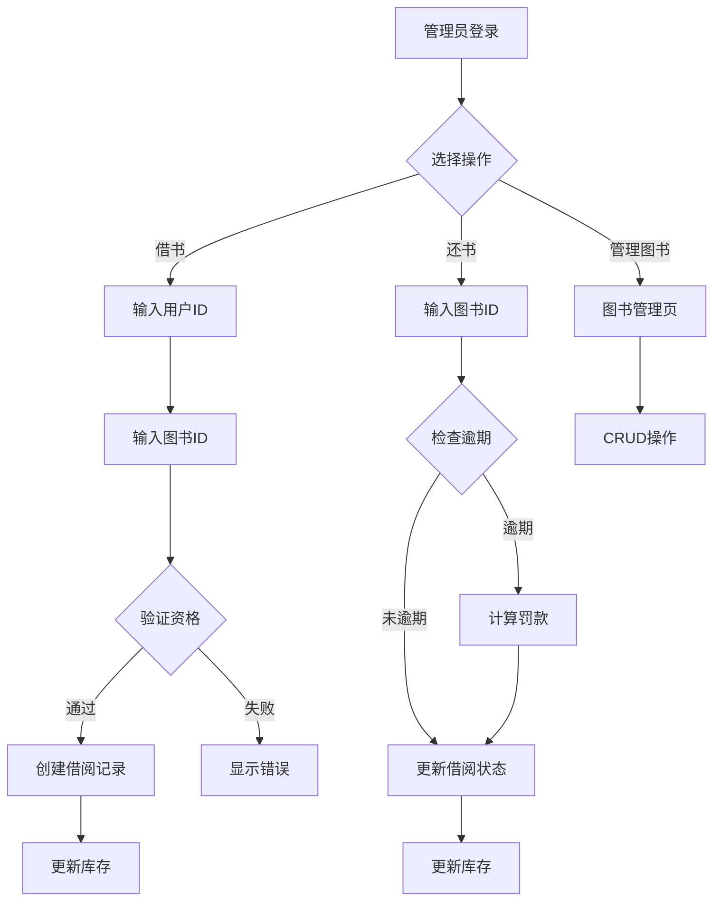

# 图书馆管理系统 - 产品需求文档 (PRD)

## 1. 产品概述
图书馆管理系统是一个用于管理图书借阅、归还和用户信息的Web应用，旨在提高图书馆运营效率，简化日常管理流程。
- 解决图书管理繁琐、借阅流程复杂的问题
- 适用于中小型图书馆、学校图书馆或社区图书室

## 2. 核心功能

### 2.1 用户角色
| 角色 | 注册方式 | 核心权限 |
|------|----------|----------|
| 管理员 | 系统预设 | 图书管理、用户管理、借阅管理、统计分析 |
| 普通用户 | 管理员添加 | 查看个人信息、借阅记录、查询图书 |

### 2.2 功能模块
1. **登录页**: 用户认证、权限验证
2. **管理后台首页**: 数据概览、快捷操作入口
3. **图书管理**: 图书列表、增删改查、分类筛选、库存管理
4. **借阅管理**: 借书、还书、借阅记录查询、逾期管理
5. **用户管理**: 用户列表、添加用户、编辑用户信息、权限管理
6. **图书分类管理**: 分类增删改查、分类树展示

### 2.3 页面详情
| 页面名称 | 模块名称 | 功能描述 |
|----------|----------|----------|
| 登录页 | 登录表单 | 用户名密码登录、记住密码、错误提示 |
| 首页 | 数据看板 | 今日借阅数、在借图书、逾期提醒、最近操作 |
| 首页 | 快捷操作 | 快速借书、快速还书、添加图书 |
| 图书管理 | 图书列表 | 分页展示、搜索筛选、状态显示 |
| 图书管理 | 图书表单 | 新增/编辑图书信息（书名、作者、ISBN、分类、库存） |
| 借阅管理 | 借还书 | 扫描/输入用户ID和图书ID进行借还操作 |
| 借阅管理 | 借阅记录 | 按时间、用户、图书筛选，显示借阅状态 |
| 用户管理 | 用户列表 | 分页展示、搜索、状态管理 |
| 用户管理 | 用户表单 | 新增/编辑用户（姓名、联系方式、角色） |
| 分类管理 | 分类列表 | 树形展示分类层级、增删改操作 |

## 3. 核心流程

### 3.1 借书流程
用户登录 → 选择借书功能 → 输入/扫描用户ID → 输入/扫描图书ID → 验证借阅资格（是否超期、是否达上限）→ 确认借阅 → 更新库存和记录

### 3.2 还书流程
用户登录 → 选择还书功能 → 输入/扫描图书ID → 检查是否逾期 → 计算罚款（如有）→ 确认还书 → 更新库存和记录

## 4. 用户界面设计

### 4.1 设计风格
- **主色调**: 深蓝色(#1a365d) + 暖金色(#d4a574) - 营造专业、学术氛围
- **辅助色**: 浅灰背景(#f7f5f2)、白色卡片、成功绿、警告橙、错误红
- **按钮风格**: 圆角(8px)、渐变背景、悬停动画效果
- **字体**: 中文使用系统字体栈，英文使用 Merriway(标题) + Source Sans Pro(正文)
- **布局**: 左侧导航 + 右侧内容区，卡片式设计
- **图标**: 简洁线性图标风格

### 4.2 页面设计概览
| 页面名称 | 模块名称 | UI元素 |
|----------|----------|--------|
| 登录页 | 登录卡片 | 居中卡片、圆角阴影、输入框带图标、登录按钮渐变动画 |
| 首页 | 数据看板 | 4个统计卡片、图表展示趋势、快捷操作按钮 |
| 图书管理 | 列表页 | 顶部搜索栏、筛选下拉、表格展示、分页器、操作按钮 |
| 借阅管理 | 操作页 | 左右分栏（用户信息+图书信息）、确认按钮、历史记录 |
| 用户管理 | 列表页 | 搜索、筛选、表格、状态标签、操作列 |

### 4.3 响应式设计
- 桌面优先设计，支持最小1024px宽度
- 平板和移动端自适应布局，侧边栏可折叠
- 触摸优化：按钮最小44px触控区域
