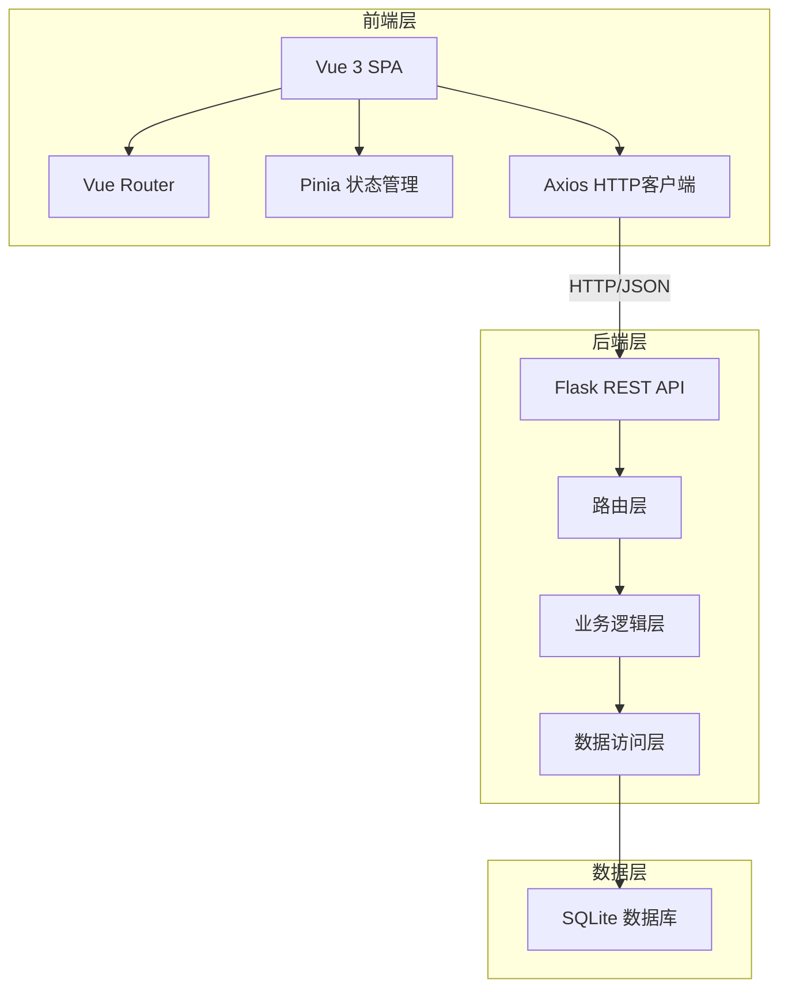
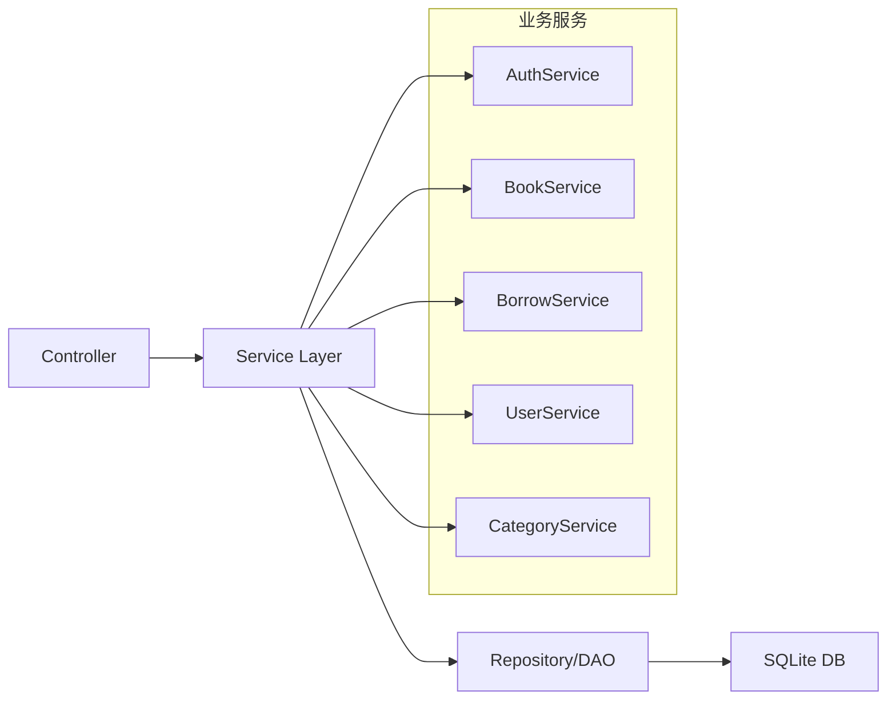
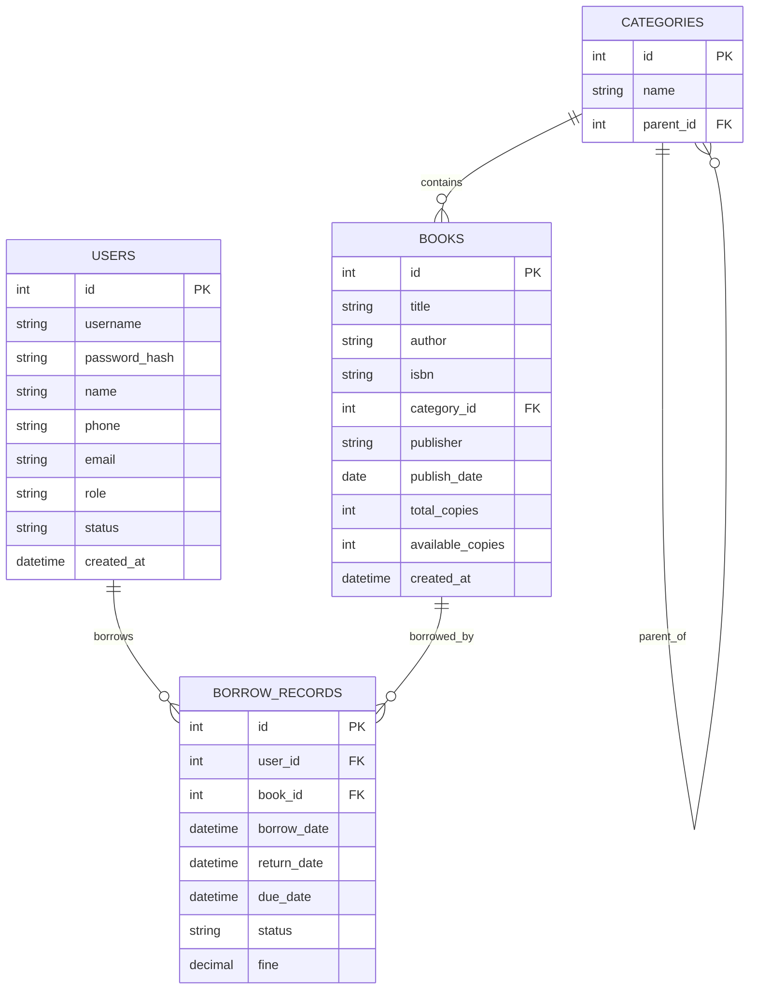

# 图书馆管理系统 - 技术架构文档

## 1. 架构设计



## 2. 技术选型

- **前端**: Vue 3 + Vue Router + Pinia + Element Plus + Axios + Vite
- **后端**: Python 3 + Flask + Flask-CORS + SQLAlchemy
- **数据库**: SQLite 3 (轻量级、零配置、适合中小型应用)
- **构建工具**: Vite (快速热更新、按需打包)
- **UI组件库**: Element Plus (丰富的组件、良好的中文支持)

## 3. 路由定义

### 前端路由
| 路由 | 页面 | 权限 |
|------|------|------|
| /login | 登录页 | 公开 |
| /dashboard | 首页/数据看板 | 管理员 |
| /books | 图书管理列表 | 管理员 |
| /books/add | 添加图书 | 管理员 |
| /books/edit/:id | 编辑图书 | 管理员 |
| /borrow | 借还书操作 | 管理员 |
| /borrow-records | 借阅记录 | 管理员 |
| /users | 用户管理 | 管理员 |
| /categories | 图书分类管理 | 管理员 |

### 后端API路由
| 路由 | 方法 | 功能 |
|------|------|------|
| /api/auth/login | POST | 用户登录 |
| /api/books | GET | 获取图书列表(分页、筛选) |
| /api/books | POST | 添加图书 |
| /api/books/:id | GET | 获取图书详情 |
| /api/books/:id | PUT | 更新图书 |
| /api/books/:id | DELETE | 删除图书 |
| /api/borrow | POST | 借书 |
| /api/return | POST | 还书 |
| /api/records | GET | 获取借阅记录 |
| /api/users | GET | 获取用户列表 |
| /api/users | POST | 添加用户 |
| /api/users/:id | PUT | 更新用户 |
| /api/users/:id | DELETE | 删除用户 |
| /api/categories | GET | 获取分类列表 |
| /api/categories | POST | 添加分类 |
| /api/categories/:id | PUT | 更新分类 |
| /api/categories/:id | DELETE | 删除分类 |

## 4. API 定义

### 通用响应格式
```json
{
  "code": 200,
  "message": "success",
  "data": {}
}
```

### 图书类型定义
```typescript
interface Book {
  id: number;
  title: string;
  author: string;
  isbn: string;
  category_id: number;
  category_name: string;
  publisher: string;
  publish_date: string;
  total_copies: number;
  available_copies: number;
  created_at: string;
}

interface BorrowRecord {
  id: number;
  user_id: number;
  user_name: string;
  book_id: number;
  book_title: string;
  borrow_date: string;
  return_date: string | null;
  due_date: string;
  status: 'borrowed' | 'returned' | 'overdue';
  fine: number;
}

interface User {
  id: number;
  username: string;
  name: string;
  phone: string;
  email: string;
  role: 'admin' | 'user';
  status: 'active' | 'inactive';
  created_at: string;
}

interface Category {
  id: number;
  name: string;
  parent_id: number | null;
  children?: Category[];
}
```

## 5. 服务器架构图



## 6. 数据模型

### 6.1 ER图



### 6.2 DDL语句

```sql
-- 用户表
CREATE TABLE users (
    id INTEGER PRIMARY KEY AUTOINCREMENT,
    username VARCHAR(50) UNIQUE NOT NULL,
    password_hash VARCHAR(255) NOT NULL,
    name VARCHAR(100) NOT NULL,
    phone VARCHAR(20),
    email VARCHAR(100),
    role VARCHAR(20) DEFAULT 'user',
    status VARCHAR(20) DEFAULT 'active',
    created_at DATETIME DEFAULT CURRENT_TIMESTAMP
);

-- 图书分类表
CREATE TABLE categories (
    id INTEGER PRIMARY KEY AUTOINCREMENT,
    name VARCHAR(100) NOT NULL,
    parent_id INTEGER REFERENCES categories(id) ON DELETE SET NULL
);

-- 图书表
CREATE TABLE books (
    id INTEGER PRIMARY KEY AUTOINCREMENT,
    title VARCHAR(200) NOT NULL,
    author VARCHAR(100) NOT NULL,
    isbn VARCHAR(20) UNIQUE NOT NULL,
    category_id INTEGER REFERENCES categories(id),
    publisher VARCHAR(100),
    publish_date DATE,
    total_copies INTEGER DEFAULT 1,
    available_copies INTEGER DEFAULT 1,
    created_at DATETIME DEFAULT CURRENT_TIMESTAMP
);

-- 借阅记录表
CREATE TABLE borrow_records (
    id INTEGER PRIMARY KEY AUTOINCREMENT,
    user_id INTEGER REFERENCES users(id),
    book_id INTEGER REFERENCES books(id),
    borrow_date DATETIME DEFAULT CURRENT_TIMESTAMP,
    return_date DATETIME,
    due_date DATETIME,
    status VARCHAR(20) DEFAULT 'borrowed',
    fine DECIMAL(10, 2) DEFAULT 0.00
);

-- 创建索引
CREATE INDEX idx_books_category ON books(category_id);
CREATE INDEX idx_books_isbn ON books(isbn);
CREATE INDEX idx_borrow_user ON borrow_records(user_id);
CREATE INDEX idx_borrow_book ON borrow_records(book_id);
CREATE INDEX idx_borrow_status ON borrow_records(status);
CREATE INDEX idx_categories_parent ON categories(parent_id);

-- 初始化数据
INSERT INTO users (username, password_hash, name, role) 
VALUES ('admin', 'hashed_password', '系统管理员', 'admin');

INSERT INTO categories (name) VALUES 
('文学'),
('历史'),
('科学'),
('技术'),
('教育'),
('艺术'),
('经济'),
('哲学');

INSERT INTO books (title, author, isbn, category_id, publisher, total_copies, available_copies) VALUES 
('活着', '余华', '9787506365437', 1, '作家出版社', 3, 3),
('百年孤独', '加西亚·马尔克斯', '9787544253994', 1, '南海出版公司', 2, 2),
('人类简史', '尤瓦尔·赫拉利', '9787508647357', 2, '中信出版社', 4, 4),
('Python编程从入门到实践', 'Eric Matthes', '9787115428028', 4, '人民邮电出版社', 5, 5);
```

## 7. 项目结构

```
libraryDemo/
├── frontend/                 # Vue前端项目
│   ├── src/
│   │   ├── api/             # API接口
│   │   ├── assets/          # 静态资源
│   │   ├── components/      # 公共组件
│   │   ├── router/          # 路由配置
│   │   ├── store/           # Pinia状态管理
│   │   ├── views/           # 页面组件
│   │   ├── App.vue
│   │   └── main.js
│   ├── index.html
│   ├── package.json
│   └── vite.config.js
│
└── backend/                  # Python后端项目
    ├── app.py               # Flask应用入口
    ├── models/              # 数据模型
    ├── routes/              # API路由
    ├── services/            # 业务逻辑
    ├── config.py            # 配置文件
    ├── requirements.txt
    └── library.db           # SQLite数据库
```
